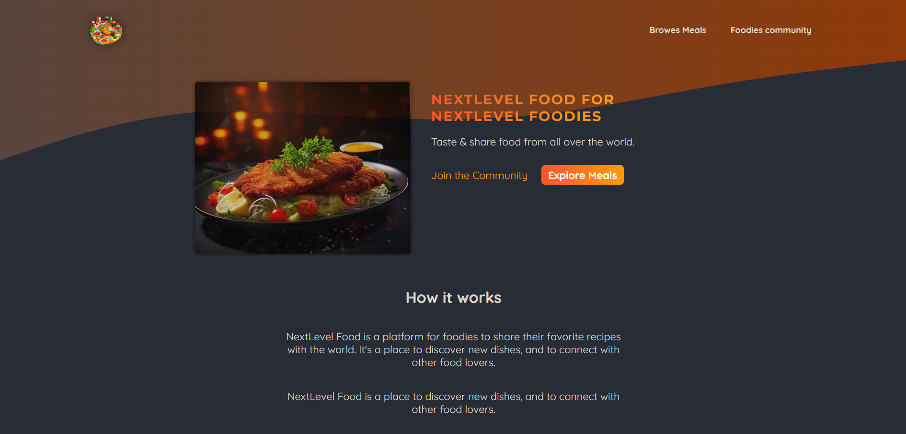
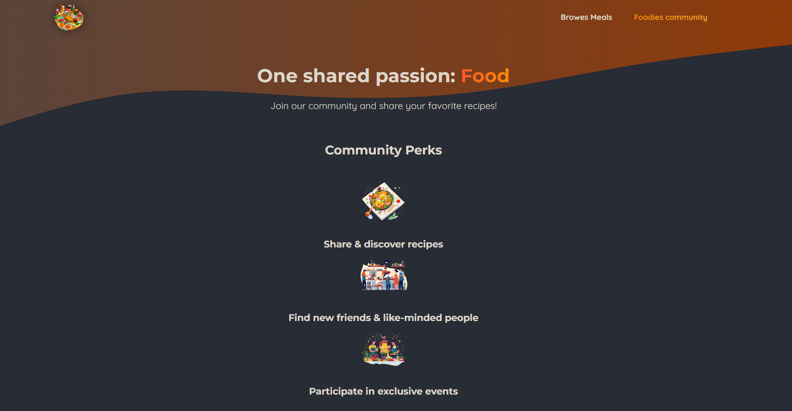
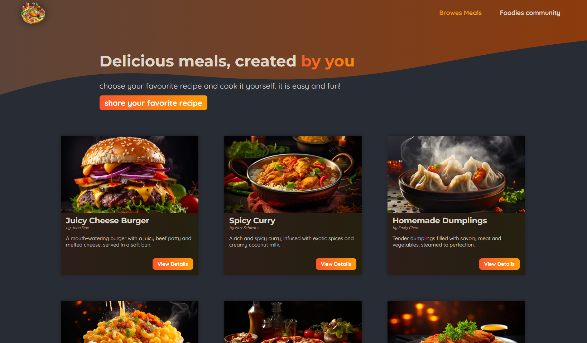
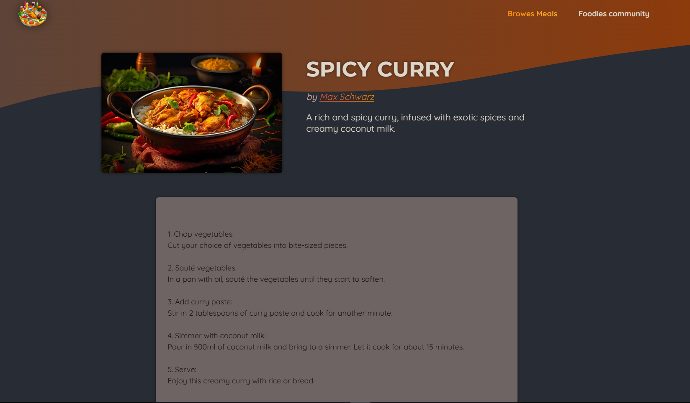
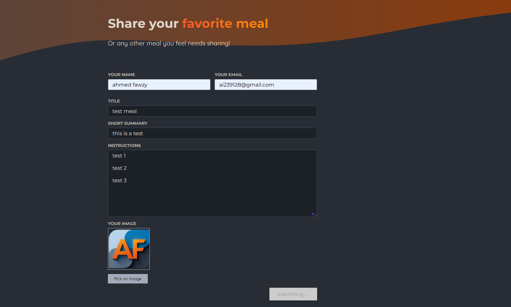

# 🍃 Wrapped Green - Restaurant Landing Page

A modern and visually appealing restaurant landing page focused on clean UI, smooth layout, and fully responsive design.

---

## Features

- Clean and attractive UI design  
- High-quality background image sections  
- Custom CSS illustrations without external vector images  
- Well-structured layout for better user experience  
- Fully responsive across all screen sizes  
- Smooth and engaging visual experience  

---

## Tech Stack

- HTML5  
- CSS3  
- JavaScript  

---

## Installation

1. Clone the repository:  
   git clone https://github.com/ahmedibra24/-Wrapped-Green-.git  

2. Open the project folder  

3. Run `index.html` in your browser  

---

## Usage

- Open the landing page in browser  
- Explore restaurant sections and UI design  
- Fully responsive experience on mobile and desktop  

---

## Screenshots

- Home
  

- About Us
  

- Menu
  

- Clients
  

- Contact
  

---

## Challenges Solved

- Creating visually appealing UI using pure CSS  
- Maintaining performance with high-quality visuals  
- Ensuring responsive design across all devices  
- Building engaging layout without heavy assets or libraries  

---

## Future Improvements

- Add animation effects for sections  
- Add reservation form  
- Add menu filtering system  
- Improve SEO optimization  